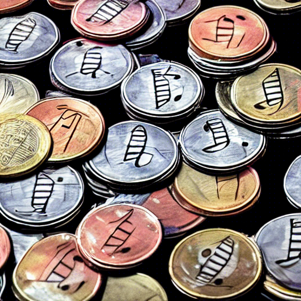

# Music Token Economy

  
above image is generated by [stable diffusion](https://github.com/CompVis/stable-diffusion) with key word "music token economy".

## Concept

token economy for music creators, secondary creators and members who join in the ecosystem and contribute to its expansion.

- music creators provide original music to ecosystem as a NFT which is called "Origin Token".
- member of ecosystem can create secondary creation as NFT which is called "Fanfic Token" using the original music provided. e.g playlists or remix music.
- secondary creation are sold in the market, and proceeds are distributed among creators, secondary creator, and ecosystem.
- in order to join the ecosystem, you need to staking token which is called "MTE = Music Token Ecosystem" to contract.
- the staked MTE will be rewarded according to the staking period, and user will receive an incentive for continuing to participate in the ecosystem.
- MTE are provided in pairs with native tokens and can be exchanged in the DEX.
- The proceeds from the sale are locked as a reward for the contract and can be withdrawn at any time. locking the proceeds in the contract allows you to control when the proceeds are taxed as income.
